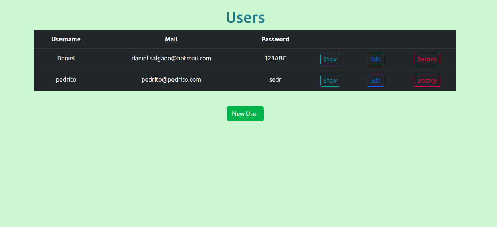

# Rails CRUD App

This a collaborative project based on a CRUP App developed in Ruby on rails, as a part of the assignment for microverse, integrating the Users controller, User model, and users views, using a form.





## Authors:
 👤 **Gonza Javier Mancilla**

- Github: [@github/gonjavi](https://github.com/gonjavi)
- Linkedin: [linkedin](https://www.linkedin.com/in/g-javier-mancilla-a686a9178/)

 👤 **Daniel alejandro Salgado**

- Github: [@github/alejocode](https://github.com/AlejoCode)
- Linkedin: [linkedin](https://www.linkedin.com/in/daniel-alejandro-salgado-sanchez-13a740b1/)

## Live Demo

[Live Demo](https://alejocode-rails-crud.herokuapp.com/)


## Tools Used
```bash
  Ruby 2.6.3
 ```
 ```bash
   Ruby on Rails 6.0.1
 ```
  ```bash
   Html5
 ```
  ```bash
   CSS3 - scss
 ```
  ```bash
Bootstrap
```
  ```bash
  PostgresSQL
  ```

## Getting Ruby Set up and necessary gems
* Install the gems listed in the Gemfile by :
```bash
$ bundle install
```
* Migrate the database by:
```bash
$ rails db:create and then, $ rails db:migrate
```
* Simply run the app with :
```bash
$ rails s
```

## 🤝 Contributing

Contributions, issues and feature requests are welcome!


## Show your support

Give a ⭐️ if you like this project!


## 📝 License

This project is [MIT](lic.url) licensed.


